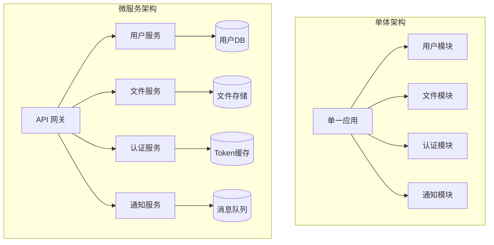
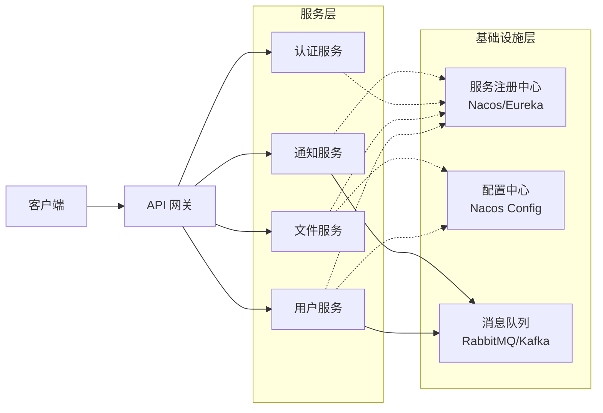
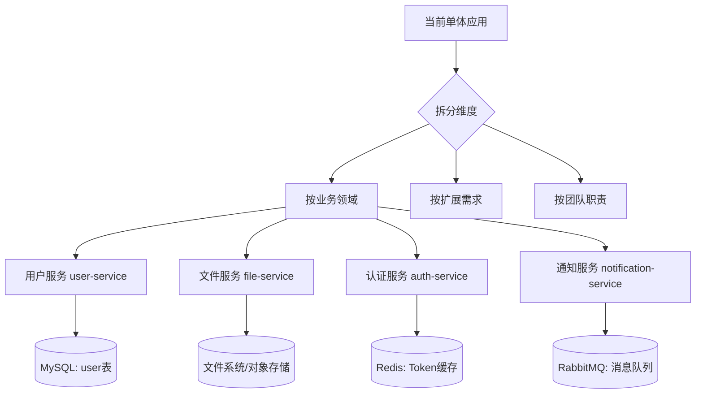
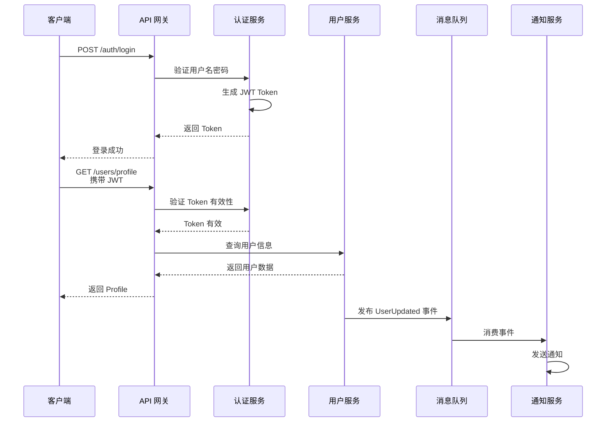
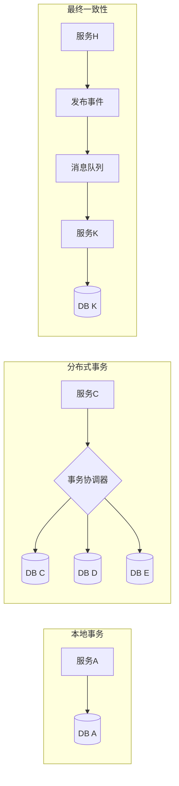
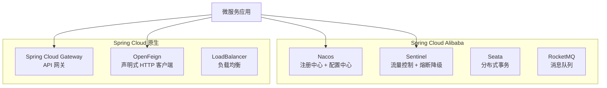
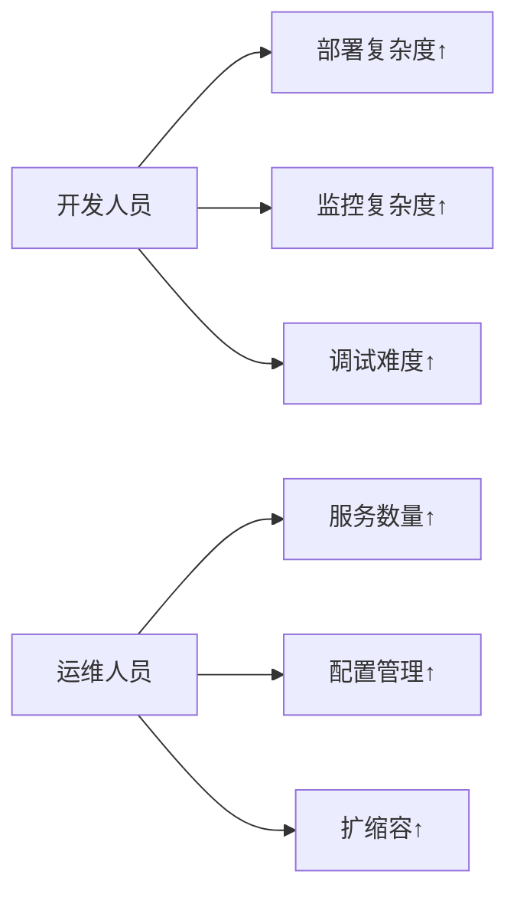

# 3.5 微服务基础 - 学习与实践

> 对应学习路线：阶段 3.5

---

## 📚 学习目标

1. 理解单体架构与微服务架构的核心差异
2. 掌握微服务拆分的基本原则（DDD、业务边界）
3. 了解服务注册发现、配置中心、API 网关等核心组件
4. 能为当前项目设计微服务演进方案
5. 理解分布式系统带来的挑战（一致性、网络延迟、故障隔离）

---

## 🎯 核心概念解析

### 1. 什么是微服务？

**微服务架构**是一种将单一应用程序拆分为一组小型服务的方法，每个服务：
- 运行在独立的进程中
- 围绕业务能力组织
- 可独立部署和扩展
- 通过轻量级机制（通常是 HTTP API）通信



### 2. 单体 vs 微服务对比

| 维度 | 单体架构 | 微服务架构 |
|------|---------|-----------|
| **开发复杂度** | 低，代码集中 | 高，需处理分布式问题 |
| **部署复杂度** | 简单，一次部署 | 复杂，需编排多个服务 |
| **扩展性** | 整体扩展，资源浪费 | 按需扩展，精细化 |
| **技术栈** | 统一技术栈 | 可多语言混合 |
| **故障隔离** | 单点故障影响全局 | 服务间隔离，容错性强 |
| **数据一致性** | ACID 事务保证 | 最终一致性，需补偿机制 |
| **适用场景** | 小型项目、快速原型 | 大型系统、高并发场景 |

### 3. 微服务核心组件



| 组件 | 作用 | 常见实现 |
|------|------|---------|
| **服务注册发现** | 管理服务实例地址，实现动态路由 | Nacos、Eureka、Consul |
| **配置中心** | 集中管理配置，支持动态刷新 | Nacos Config、Spring Cloud Config |
| **API 网关** | 统一入口、鉴权、限流、路由 | Spring Cloud Gateway、Kong |
| **负载均衡** | 分散请求到多个实例 | Ribbon、LoadBalancer |
| **熔断降级** | 防止雪崩效应，提高可用性 | Sentinel、Hystrix、Resilience4j |
| **链路追踪** | 跟踪请求在各服务间的调用链 | SkyWalking、Zipkin、Jaeger |
| **消息队列** | 异步解耦、削峰填谷 | RabbitMQ、Kafka、RocketMQ |

---

## 🔧 当前项目微服务演进方案

### 1. 服务拆分策略

基于当前项目的业务模块，建议按以下方式拆分：



#### 推荐拆分方案

| 服务名称 | 职责 | 端口 | 数据库 |
|---------|------|------|--------|
| **auth-service** | 用户认证、JWT 签发、权限验证 | 8081 | Redis |
| **user-service** | 用户信息管理、查询、统计 | 8082 | MySQL (user表) |
| **file-service** | 文件上传、下载、清理、缩略图 | 8083 | 文件系统 |
| **notification-service** | 邮件发送、站内信、推送通知 | 8084 | 无状态 |

### 2. 服务间通信方式



| 通信方式 | 场景 | 优点 | 缺点 |
|---------|------|------|------|
| **同步 HTTP/REST** | 实时查询、强依赖调用 | 简单直观、易于调试 | 耦合度高、延迟累积 |
| **异步消息队列** | 事件通知、解耦操作 | 松耦合、削峰填谷 | 最终一致性、复杂性高 |
| **gRPC** | 高性能内部调用 | 性能好、强类型 | 学习成本高、浏览器不支持 |

### 3. 数据一致性策略



| 策略 | 说明 | 适用场景 |
|------|------|---------|
| **本地事务** | 单服务内 ACID 保证 | 大部分 CRUD 操作 |
| **Saga 模式** | 长事务拆分为多个本地事务 | 订单流程、跨服务业务 |
| **TCC** | Try-Confirm-Cancel 三阶段 | 金融交易、强一致性要求 |
| **事件驱动** | 通过消息队列实现最终一致性 | 通知、统计、缓存更新 |

**当前项目推荐**：使用**事件驱动 + 本地事务**，通过 RabbitMQ 实现最终一致性。

---

## 🛠️ 技术选型建议

### 1. Spring Cloud Alibaba 生态



| 组件 | 推荐方案 | 理由 |
|------|---------|------|
| **注册中心** | Nacos | 同时支持注册发现和配置管理，中文文档完善 |
| **配置中心** | Nacos Config | 与注册中心一体化，支持动态刷新 |
| **API 网关** | Spring Cloud Gateway | 响应式编程，性能好，与 Spring 生态无缝集成 |
| **服务调用** | OpenFeign | 声明式接口，简化远程调用代码 |
| **熔断降级** | Sentinel | 实时监控、规则配置灵活、阿里生产验证 |
| **分布式事务** | Seata（后期引入） | 支持 AT、TCC、Saga 多种模式 |
| **链路追踪** | SkyWalking | 无侵入、可视化好、性能开销小 |

### 2. 为什么选择 Spring Cloud Alibaba？

1. **国产化支持好**：中文文档、社区活跃、阿里大规模生产验证
2. **组件整合度高**：Nacos 同时解决注册发现和配置管理
3. **学习曲线平缓**：与 Spring Boot 无缝衔接
4. **生态完整**：覆盖微服务所有核心场景

---

## 🧩 实践步骤概览

### 阶段 1：理论基础（当前文档）
- ✅ 理解微服务核心概念
- ✅ 设计服务拆分方案
- ✅ 选择技术栈

### 阶段 2：环境搭建（下一步）
- 安装 Nacos Server
- 创建父工程和多模块结构
- 配置服务注册发现

### 阶段 3：服务拆分
- 抽取 auth-service
- 抽取 user-service
- 抽取 file-service
- 实现服务间调用

### 阶段 4：基础设施完善
- 集成 API 网关
- 配置统一鉴权
- 实现熔断降级
- 添加链路追踪

### 阶段 5：高级特性
- 分布式事务（Seata）
- 灰度发布
- 服务监控告警

---

## ⚠️ 微服务的挑战与应对

### 1. 分布式复杂性

| 挑战 | 表现 | 解决方案 |
|------|------|---------|
| **网络延迟** | 服务调用耗时增加 | 缓存、异步化、连接池优化 |
| **部分失败** | 某个服务不可用导致整体失败 | 熔断降级、超时控制、重试机制 |
| **数据一致性** | 跨服务事务难以保证 | Saga、TCC、事件驱动、最终一致性 |
| **定位困难** | 问题排查链路长 | 链路追踪、集中日志、监控告警 |

### 2. 运维成本增加



**应对策略**：
- 引入 Docker + Kubernetes 容器化部署
- 使用 CI/CD 自动化流水线
- 建立完善的监控告警体系

### 3. 何时不应该使用微服务？

❌ **不建议使用的场景**：
- 团队规模小（< 10 人）
- 业务简单，迭代速度快
- 没有明确的性能瓶颈
- 缺乏 DevOps 基础设施

✅ **适合使用的场景**：
- 系统复杂度持续增加
- 不同模块扩展需求差异大
- 多团队协作开发
- 需要高可用性和弹性伸缩

---

## 📊 当前项目演进路线图

```mermaid
timeline
    title 微服务演进时间线
    
    section 第一阶段 : 单体优化
        完善 JWT 认证
        引入 Redis 缓存
        集成 RabbitMQ
        实现定时任务
    
    section 第二阶段 : 服务拆分准备
        模块化重构
        接口标准化
        数据库分库设计
        编写服务契约
    
    section 第三阶段 : 微服务落地
        搭建 Nacos 环境
        拆分 auth-service
        拆分 user-service
        拆分 file-service
        集成 API 网关
    
    section 第四阶段 : 生产就绪
        熔断降级保护
        链路追踪接入
        自动化部署
        监控告警体系
```

---

## 🧪 动手实践建议

### 练习 1：绘制当前系统的架构图
- 识别现有的业务边界
- 标注模块间的依赖关系
- 找出可以独立部署的单元

### 练习 2：设计服务接口契约
- 为每个拟拆分的服务定义 API
- 确定服务间的数据交互格式
- 考虑版本兼容性策略

### 练习 3：模拟服务故障
- 手动停止某个"服务"（模块）
- 观察对其他模块的影响
- 设计容错方案

---

## 📝 学习总结

- 微服务不是银弹，**不要为了微服务而微服务**
- 先从单体架构做好模块化，再逐步演进
- **服务拆分的关键是找到正确的边界**（业务内聚、松散耦合）
- 分布式系统带来的复杂性需要充分评估团队能力
- 当前项目处于学习阶段，先掌握理论，后续再实践拆分

---

## 📚 参考资料

- [Spring Cloud Alibaba 官方文档](https://spring-cloud-alibaba-group.github.io/github-pages/hoxton/zh-cn/index.html)
- [微服务架构设计模式](https://microservices.io/patterns/microservices.html)
- [Nacos 官方文档](https://nacos.io/zh-cn/docs/what-is-nacos.html)
- [Domain-Driven Design (DDD)](https://martinfowler.com/bliki/DomainDrivenDesign.html)
