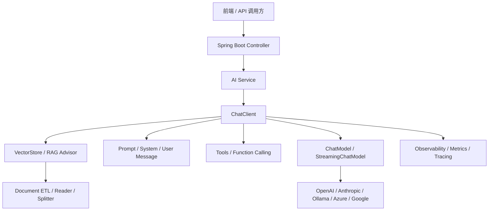
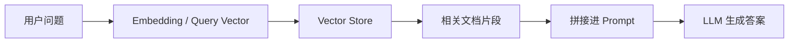
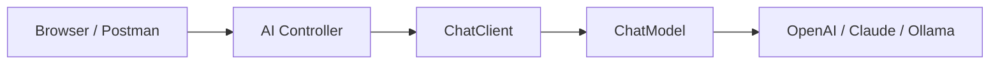
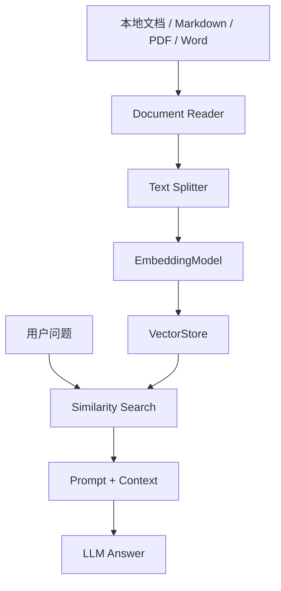
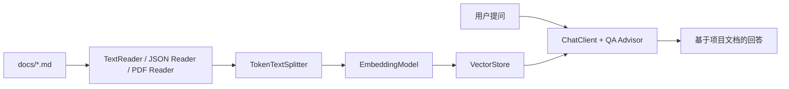
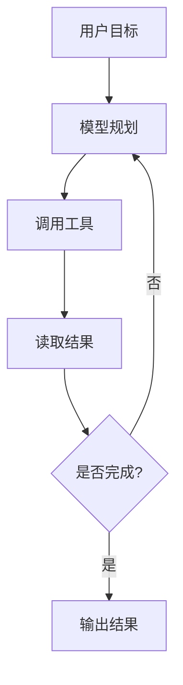
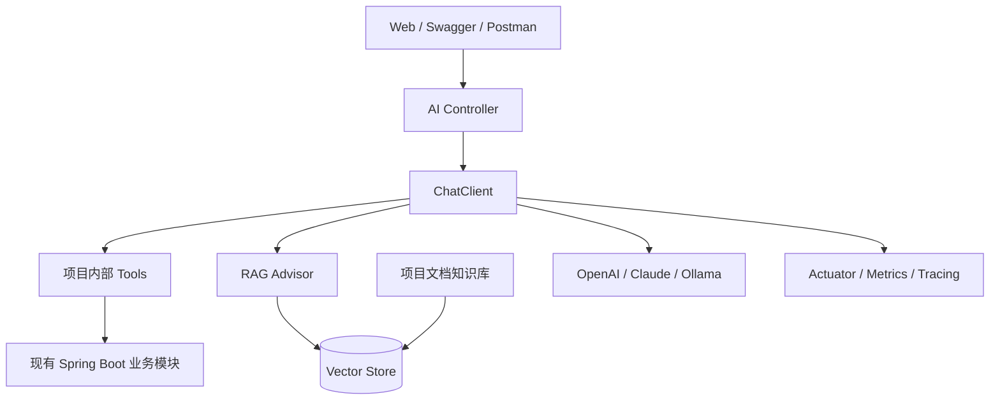

# Spring AI 学习与快速上手指南

> 对应学习路线：阶段 4（4.1 ~ 4.7）

---

## 📌 先看结论

如果你想用最短时间把 Spring AI 跑起来，建议按这个顺序学：

1. **4.1 AI 基础概念**：先搞清 Prompt、Token、Embedding、RAG、Tool Calling 是什么
2. **4.2 Spring AI 入门**：先跑通一个最小聊天接口
3. **4.3 Prompt 工程**：学会写 System Prompt、模板化 Prompt、结构化输出
4. **4.5 Function Calling**：让模型调用你项目里的 Java 方法或内部 API
5. **4.4 + 4.6 向量数据库 / 文档问答**：做一个本地文档问答 Demo
6. **4.7 Agent 模式**：最后再做多步骤规划与执行

如果上来就做 Agent，通常会被 Prompt、工具、检索、上下文管理这些基础问题反噬。

---

## ⚠️ 当前项目先要注意的版本点

根据当前项目：

- **Spring Boot**：`3.3.5`
- **Java**：`17`

根据最新 Spring AI 官方文档：

- **Spring AI 1.0.0+** 推荐配合 **Spring Boot 3.4.x / 3.5.x**
- Spring AI 1.0.0 及之后版本已经发布到 **Maven Central**

这意味着：

> **如果你后面要真的把 Spring AI 集成进当前项目，建议先把 Spring Boot 从 3.3.5 升到 3.4.x 或 3.5.x。**

不先处理版本兼容，后面很容易在依赖管理和自动配置上踩坑。

---

## 🧠 阶段 4 技术栈总览

Spring AI 的核心价值不是“帮你调一个大模型接口”，而是：

> **用 Spring 风格，把模型、Prompt、工具、向量检索、观测、文档 ETL 这些能力整合成一套可维护的 Java 应用架构。**

### Spring AI 能做什么

根据最新官方文档，Spring AI 提供的重点能力包括：

- **Chat / Streaming / Embedding / Image / Audio** 等模型抽象
- **ChatClient API**
- **Structured Output**
- **Tool / Function Calling**
- **Advisors API**
- **Conversation Memory**
- **RAG（Retrieval Augmented Generation）**
- **Vector Store 抽象**
- **文档 ETL**
- **Observability**

---

## 🏗️ Spring AI 整体架构怎么理解



可以把它理解成 5 层：

| 层次 | 作用 |
|------|------|
| **Provider 层** | OpenAI、Anthropic、Ollama 等模型提供方 |
| **Model 层** | `ChatModel`、`EmbeddingModel` 等统一抽象 |
| **Client 层** | `ChatClient` 负责构建 Prompt、挂载 Tools / Advisors |
| **增强层** | RAG、Memory、Tool Calling、Structured Output |
| **应用层** | Controller、Service、业务 API |

---

## 4.1 AI 基础概念：先把这些词讲明白

### 1. Prompt

Prompt 就是你给模型的输入指令，不只是“问一句话”，还包括：

- system message：告诉模型“你是谁、要怎么回答”
- user message：用户问题
- tool result：工具执行结果
- retrieved context：RAG 检索到的上下文

### 2. Token

Token 可以近似理解为“模型处理文本的基本计费与计算单位”。

你要关心它，是因为：

- 输入太长会超上下文窗口
- 输出越长越贵
- RAG、Memory、Tool Calling 都会增加 token 消耗

### 3. Embedding

Embedding 是把文本转换成向量。

用途：

- 语义检索
- 文档问答
- 相似内容推荐

### 4. RAG

RAG = **先查资料，再回答**



### 5. Tool Calling

Tool Calling = **模型知道什么时候该调用外部工具，但真正执行工具的是你的应用**

这是非常关键的安全边界：

> 模型不会直接访问你的数据库和 API，它只能“请求你执行某个工具”。

### 6. Agent

Agent 不是一个神秘新框架，本质上是：

> **模型 + 工具 + 记忆 + 规划 + 循环执行**

典型循环：

```text
理解任务 -> 制定步骤 -> 调工具 -> 读取结果 -> 判断是否继续 -> 输出最终结果
```

---

## 4.2 Spring AI 入门：你最先需要掌握什么

### 1. 关键接口

根据最新文档，聊天相关最核心的是：

| 接口 / API | 作用 |
|------------|------|
| `ChatModel` | 同步对话调用 |
| `StreamingChatModel` | 流式输出 |
| `ChatClient` | 推荐的高层 Fluent API |
| `Prompt` | 封装消息与选项 |
| `Message` | `system` / `user` / `assistant` 等消息角色 |

### 2. 为什么现在更推荐 `ChatClient`

因为它比直接调 `ChatModel.call()` 更贴近真实业务场景：

- 更适合拼 system / user prompt
- 更适合挂载 advisors
- 更适合 tools
- 更适合 streaming

### 3. 最小聊天接口架构



### 4. 最小代码示例

```java
@RestController
public class AiController {

    private final ChatClient chatClient;

    public AiController(ChatClient.Builder chatClientBuilder) {
        this.chatClient = chatClientBuilder.build();
    }

    @GetMapping("/ai/chat")
    public String chat(@RequestParam String message) {
        return this.chatClient.prompt()
                .user(message)
                .call()
                .content();
    }
}
```

### 5. 第一阶段建议实践

先不要一上来接复杂 RAG，先跑通：

1. `/ai/chat`：普通问答
2. `/ai/stream`：流式输出
3. 加一个 system prompt，控制回答风格

---

## 4.3 Prompt 工程：Spring AI 里怎么落地

Prompt 工程不是“多写几句提示词”，而是要解决：

- 角色约束
- 输出格式控制
- 少幻觉
- 结果可解析

### 推荐结构

```text
System:
你是一个 Spring Boot 学习助手，只用中文回答，回答要简洁、准确、可执行。

User:
帮我解释 @Transactional 的传播行为，并给一个最小示例。
```

### 在项目里怎么用

```java
String result = chatClient.prompt()
        .system("你是一个企业级 Java 架构助手，只用中文回答。")
        .user("解释 Spring Cache 和 Redis 的区别")
        .call()
        .content();
```

### 最值得练的 3 件事

1. **System Message**：定义角色、语言、风格、边界
2. **Prompt Template**：把用户变量模板化
3. **Structured Output**：让模型输出 JSON / POJO，而不是松散文本

### Prompt 工程常见误区

| 误区 | 问题 |
|------|------|
| 指令过长过杂 | 模型容易抓不住重点 |
| 只写用户问题，不写系统约束 | 风格和输出结构容易漂 |
| 不限制输出格式 | 后端难以解析 |
| 不约束“未知时怎么答” | 幻觉概率升高 |

---

## 4.4 向量数据库：RAG 的基础设施

### Spring AI 里的角色分工

| 组件 | 作用 |
|------|------|
| `EmbeddingModel` | 把文本转向量 |
| `Document` | 文档对象 |
| `VectorStore` | 存储与检索向量 |
| `SearchRequest` | 定义 topK、阈值、过滤条件 |
| `QuestionAnswerAdvisor` / `RetrievalAugmentationAdvisor` | 开箱即用 RAG 模式 |

### 基本流程



### 最新文档里值得关注的点

- `VectorStore` 提供统一抽象
- 支持多种向量数据库
- `SearchRequest` 支持 `topK`、`similarityThreshold`
- 支持 **SQL-like metadata filter**

### 第一版怎么选型

如果你只是学习：

1. 先用 **内存型 / 本地友好的 VectorStore**
2. 跑通文档导入、切分、Embedding、检索
3. 再考虑 Redis / PostgreSQL PGVector / Elasticsearch / Milvus 等外部存储

---

## 4.5 Function Calling：让模型调用你的项目 API

这是和你当前 Spring Boot 项目结合最紧密的一章。

### 核心思想

模型不会直接删用户、查数据库、上传文件，它只会：

1. 判断“我需要调用哪个工具”
2. 生成工具调用参数
3. 把请求交给你的应用执行

### 官方推荐模式

Spring AI 支持通过 `@Tool` 暴露方法：

```java
class UserTools {

    @Tool(description = "根据用户ID查询用户信息")
    public String getUserById(Long id) {
        return "...";
    }
}
```

然后挂到 `ChatClient`：

```java
String response = ChatClient.create(chatModel)
        .prompt("帮我查询 1 号用户")
        .tools(new UserTools())
        .call()
        .content();
```

### 这章和你当前项目最适合怎么结合

你现在项目里已经有：

- 用户管理
- 文件上传
- JWT / 权限
- Redis
- MQ

所以最适合暴露成 AI Tools 的能力是：

| Tool | 对应现有项目能力 |
|------|------------------|
| 查询用户信息 | 用户模块 |
| 分页查询用户 | 用户模块 |
| 上传文件摘要说明 | 文件模块 |
| 获取系统当前时间 / 配置 | 配置模块 |

### 一定要注意的安全点

- Tool 不等于开放整个 Service
- AI 只能拿到你显式暴露的方法
- 高风险操作必须做鉴权、参数校验、审计

---

## 4.6 文档问答：最适合当前项目的 AI 实践方向

这一章其实是你最容易做出“能展示价值”的部分。

### 为什么适合你现在做

因为你项目里已经有大量学习文档：

- `docs\*.md`
- JWT 指南
- MyBatis-Plus 笔记
- 缓存 / MQ / 微服务文档

这些内容天然适合做一个 **“项目知识库问答”**。

### 最小可行架构



### 最新文档里和 RAG 相关的重点

- `QuestionAnswerAdvisor`
- `RetrievalAugmentationAdvisor`
- `VectorStoreDocumentRetriever`
- 可动态传入过滤表达式
- 可自定义 PromptTemplate

### 第一版建议实践

做一个接口：

```text
POST /ai/docs/ask
```

功能：

1. 读取本地 `src/main/resources/docs`
2. 切分为文档块
3. 写入向量库
4. 用户提问时做相似度检索
5. 基于检索上下文回答

这是最适合你当前项目的第一个 Spring AI 业务 Demo。

---

## 4.7 Agent 模式：最后再学，不要最先上

### Agent 的典型执行流



### 它适合什么场景

- 多步骤任务规划
- 需要多次调用工具
- 需要中间判断和修正

### 为什么现在不建议你第一个就做

因为 Agent 会同时放大这些问题：

- Prompt 不稳定
- Tool 不完善
- 检索质量不够
- 上下文过长
- 结果不可控

### 更合理的顺序

1. 先做单轮 Chat
2. 再做 Tool Calling
3. 再做 RAG
4. 最后才做 Agent

---

## 🚀 一条最实用的学习 / 实践路线

### 路线 A：最低成本体验 Spring AI

目标：先建立完整认知，不追求复杂场景。

1. 升级项目到 Spring Boot 3.4.x / 3.5.x
2. 接一个模型提供方（OpenAI / Claude / Ollama）
3. 做一个 `/ai/chat` 普通问答接口
4. 再做 `/ai/stream` 流式输出

### 路线 B：和当前项目结合最紧

目标：做出真正和你项目有关的 AI 功能。

1. 接入 `ChatClient`
2. 给用户查询做 Tool Calling
3. 给 `docs` 目录做文档问答
4. 让 AI 回答“这个项目的缓存是怎么做的？”、“JWT 怎么实现的？”

### 路线 C：面向作品集 / 展示效果

目标：做一个更完整的 AI 应用演示。

1. 项目知识库问答
2. Tool Calling 调内部 API
3. Conversation Memory
4. 简单 Agent：先查文档，再查用户，再汇总回答

---

## 🛠️ 推荐你第一批动手做的 5 个 Demo

| 优先级 | Demo | 对应章节 |
|--------|------|----------|
| 1 | 简单聊天接口 | 4.2 |
| 2 | System Prompt + 输出约束 | 4.3 |
| 3 | 查询用户的 Tool Calling | 4.5 |
| 4 | docs 目录问答 | 4.4 + 4.6 |
| 5 | 简单多步骤 Agent | 4.7 |

---

## 🧪 最小实践清单

### 第 1 周：先跑通

1. 了解 Prompt / Token / Embedding / RAG / Tool Calling
2. 升级 Boot 版本
3. 接通一个模型
4. 跑通最小问答接口

### 第 2 周：做项目结合

1. 给项目增加 AI Controller
2. 用 Tool 暴露查询用户能力
3. 试着做流式输出

### 第 3 周：做知识库

1. 读取 `docs` 目录
2. 切分文档
3. 向量化
4. 用 RAG 回答问题

### 第 4 周：做增强能力

1. 加 Conversation Memory
2. 加 Observability
3. 尝试简单 Agent

---

## 📊 建议的最终项目形态

如果你把阶段 4 学完，当前项目最值得演进成下面这样：



对应你这个项目，最自然的 AI 入口可以是：

- `/ai/chat`
- `/ai/docs/ask`
- `/ai/users/assistant`
- `/ai/ops/assistant`

---

## 📝 最后怎么判断自己“学会了”

当你能完成下面 4 件事，说明阶段 4 基本入门了：

1. 能解释 `ChatClient`、`ChatModel`、`EmbeddingModel`、`VectorStore` 的角色区别
2. 能写一个最小聊天接口
3. 能做一个基于本地文档的 RAG 问答
4. 能让模型调用你项目里的一个 Tool

如果再往前一步：

5. 你能解释为什么 Agent 不应该最先做

那你对 Spring AI 的理解就已经比较扎实了。

---

## 📚 参考资料

- [Spring AI Reference](https://docs.spring.io/spring-ai/reference/)
- [Spring AI Getting Started](https://docs.spring.io/spring-ai/reference/getting-started.html)
- [Spring AI ChatClient API](https://docs.spring.io/spring-ai/reference/api/chatclient.html)
- [Spring AI ChatModel API](https://docs.spring.io/spring-ai/reference/api/chatmodel.html)
- [Spring AI Tools / Function Calling](https://docs.spring.io/spring-ai/reference/api/tools.html)
- [Spring AI RAG](https://docs.spring.io/spring-ai/reference/api/retrieval-augmented-generation.html)
- [Spring AI Vector Databases](https://docs.spring.io/spring-ai/reference/api/vectordbs.html)
- [Spring AI Observability](https://docs.spring.io/spring-ai/reference/observability/index.html)
